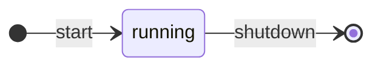

# Actor
An actor can run as one or multiple workers as tokio tasks. Such an actor can receive messages and send messages to other actors.

<div align="center">



</div>

Actor types:
 - **Actor**: Implements a `start` function.
 - **One-shot actor**: Implements a `start` function and runs only once.
 - **One-shot blocking actor**: Implements a `start_and_wait` function and runs only once, blocking all other actors from execution.

## Macros
A macro generates function to allow to initialize the fields of an actor.

There are three types of macros:
- `#[accessor]`: A field to access a "global" state as `Option<SharedState<MarketState>>`
- `#[consumer]`: A field that provides an access to consume event by `Option<Broadcaster<...>>`
- `#[producer]`: A field that allows to produce new event using `Option<Broadcaster<...>>`


### Example
Define a struct with the following fields and add the macros as you need:
```rust,ignore
#[derive(Accessor, Consumer, Producer)]
pub struct ExampleActor {
    #[accessor]
    market: Option<SharedState<Market>>,
    #[consumer]
    mempool_events_rx: Option<Broadcaster<MempoolEvents>>,
    #[producer]
    compose_channel_tx: Option<Broadcaster<MessageTxCompose>>,
}
```
The macro generates the following functions:
```rust,ignore
fn init_example_actor() -> ExampleActor {
    let market_state = SharedState::new(MarketState::new());
    let mempool_events_channel = Broadcaster::new(10);
    let compose_channel = Broadcaster::new(10);
    
    ExampleActor::new()
        .access(market_state.clone()) // <-- these functions are generated by the macro
        .consume(mempool_events_channel.clone())
        .produce(compose_channel.clone());
}
```